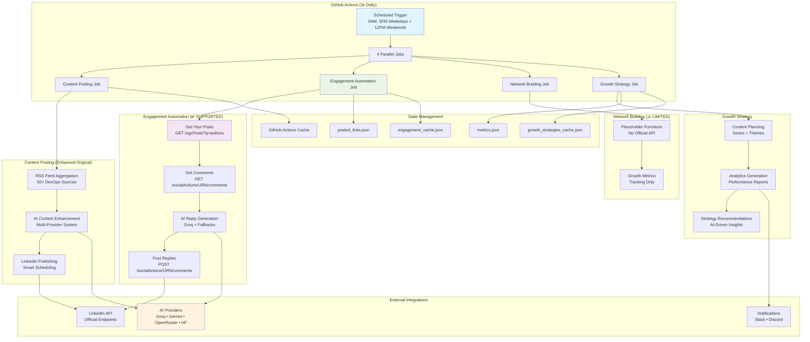
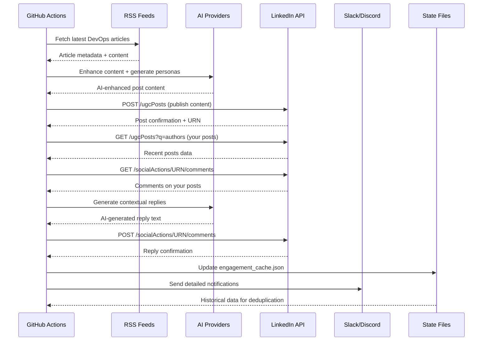

# 🚀 LinkedIn DevOps Growth & Engagement Automation

> **Automated LinkedIn content pipeline with AI-powered engagement for DevOps thought leadership**

An enterprise-grade system that curates DevOps content, generates expert-level posts, auto-replies to comments on **your** posts using official LinkedIn APIs, and reports results via Slack.

[](https://github.com/features/actions)
[](https://python.org)
[](https://developer.linkedin.com)

---

## 📋 Table of Contents
- [✨ Features Overview](#-features-overview)
- [🎛️ Feature Toggle System](#️-feature-toggle-system)
- [🏗️ System Architecture](#-system-architecture)
- [� Complete Workflow Execution Flow](#-complete-workflow-execution-flow)
- [�📝 Content Formats](#-content-formats)
- [🤖 AI-Powered Dynamic Personas](#-ai-powered-dynamic-personas)
- [🌐 RSS Feed Sources](#-rss-feed-sources)
- [🔧 AI Provider System](#-ai-provider-system)
- [💬 Auto-Reply to Comments](#-auto-reply-to-comments)
- [🔔 Notifications](#-notifications)
- [🚀 Quick Start](#-quick-start)
- [⚙️ Configuration](#️-configuration)
- [📊 Workflow Schedule](#-workflow-schedule)
- [🧭 Project Structure](#-project-structure)
- [🛠️ Troubleshooting](#-troubleshooting)
- [🔒 Required Secrets](#-required-secrets)
- [✅ What Works / ⚠️ What Doesn’t](#-what-works--️-what-doesnt)
- [📜 License](#-license)

---

## ✨ Features Overview

### ✅ What Works (Official LinkedIn API)
| Feature | Description | API Endpoint |
|---------|-------------|--------------|
| Content Posting | Post curated DevOps content to **your** profile | `POST /ugcPosts` |
| Read Your Posts | Retrieve your recent posts | `GET /ugcPosts?q=authors` |
| Read Comments | Get comments on **your** posts | `GET /socialActions/{urn}/comments` |
| Reply to Comments | Auto-reply on **your** posts | `POST /socialActions/{urn}/comments` |
| Profile Info | Get your profile ID | `GET /me` |

### ⚠️ Not Supported (No Official API — Disabled by Default)
| Feature | Reason |
|---------|--------|
| Trending Post Discovery | No search/trending API |
| Influencer Engagement | Cannot discover others’ posts via API |
| Connection Requests | Unofficial endpoints only |
| Strategic Likes | Cannot discover posts to like via API |

---

## 🎛️ Feature Toggle System
Controlled from the workflow dispatch inputs and env vars.

### Supported (default **true**)
```yaml
ENABLE_CONTENT_POSTING: true      # Post curated DevOps content
ENABLE_AUTO_REPLY_COMMENTS: true  # AI replies on your posts
ENABLE_AI_COMMENTS: true          # AI for content/comment generation
MAX_REPLIES_PER_RUN: 10           # Cap auto-replies per run
```

### Not Supported (default **false**)
```yaml
ENABLE_TRENDING_COMMENTS: false      # ⚠️ No API
ENABLE_INFLUENCER_ENGAGEMENT: false  # ⚠️ No API
ENABLE_HR_CONNECTIONS: false         # ⚠️ No API
ENABLE_STRATEGIC_LIKES: false        # ⚠️ No API
```

---

## 🏗️ System Architecture

### Enhanced Multi-Job Automation Pipeline



### 🎯 Core Design Principles

| Principle | Implementation |
|-----------|----------------|
| **API Compliance** | Uses only official LinkedIn API endpoints |
| **Rate Limiting** | Smart backoff and quota management |
| **Fault Tolerance** | Multi-provider AI failover system |
| **State Management** | Persistent cache with duplicate prevention |
| **Observability** | Comprehensive logging and Slack notifications |
| **Security** | GitHub Secrets integration, no hardcoded credentials |

### 📊 Data Flow Architecture



---

## � Complete Workflow Execution Flow

This section provides a comprehensive overview of everything that happens when the workflow runs, from start to finish.

### 🔄 Triggers

| Trigger | Schedule | Description |
|---------|----------|-------------|
| **Cron 1** | `30 3 * * 1-5` | **9 AM IST** weekdays (Mon-Fri) |
| **Cron 2** | `30 11 * * 1-5` | **5 PM IST** weekdays (Mon-Fri) |
| **Cron 3** | `30 6 * * 0,6` | **12 PM IST** weekends (Sat-Sun) |
| **Manual** | `workflow_dispatch` | Run anytime with custom inputs |

### 🎛️ Input Options (Manual Dispatch Only)

| Input | Options | Default |
|-------|---------|---------|
| `engagement_mode` | full_automation, comments_only, connections_only, content_only, growth_strategy_only | `full_automation` |
| `dry_run` | true/false | `false` |
| `post_format` | auto, digest, deep_dive, quick_tip, case_study, hot_take, lessons | `auto` |
| `enable_content_posting` | true/false | `true` ✅ |
| `enable_auto_reply_comments` | true/false | `true` ✅ |
| `enable_hr_connections` | true/false | `false` ⚠️ |
| `enable_trending_comments` | true/false | `false` ⚠️ |
| `enable_influencer_engagement` | true/false | `false` ⚠️ |
| `enable_strategic_likes` | true/false | `false` ⚠️ |

### 📊 Job Execution Flow

```
┌─────────────────────────────────────────────────────────────────┐
│  WORKFLOW TRIGGERED (schedule or manual)                        │
└───────────────────────────────┬─────────────────────────────────┘
                                │
                                ▼
┌─────────────────────────────────────────────────────────────────┐
│  JOB 1: SETUP (runs first - determines what else runs)         │
│  ─────────────────────────────────────────────────────────────  │
│  • Checks: schedule vs workflow_dispatch                        │
│  • Sets outputs:                                                 │
│    - run_content_posting    (true/false)                        │
│    - run_engagement         (true/false)                        │
│    - run_network_building   (true/false)                        │
│    - run_growth_strategy    (true/false)                        │
│    - is_dry_run             (true/false)                        │
│                                                                  │
│  📅 SCHEDULED: Only supported features enabled                  │
│  👤 MANUAL: Respects all user input toggles                     │
└───────────────────────────────┬─────────────────────────────────┘
                                │
        ┌───────────────────────┼───────────────────────┐
        │                       │                       │
        ▼                       ▼                       ▼
┌───────────────────┐  ┌───────────────────┐  ┌───────────────────┐
│ JOB 2: POST       │  │ JOB 3: ENGAGEMENT │  │ JOB 5: GROWTH     │
│ DEVOPS CONTENT    │  │ AUTOMATION        │  │ STRATEGY          │
│ ✅ SUPPORTED      │  │ ✅ SUPPORTED      │  │ ✅ SUPPORTED      │
│                   │  │ (auto-reply only) │  │                   │
│ if: run_content   │  │ if: run_engagement│  │ if: run_growth    │
│ _posting == true  │  │ == true           │  │ _strategy == true │
└───────────────────┘  └───────────────────┘  └───────────────────┘
        │                       │                       │
        │              ┌────────┴────────┐              │
        │              │                 │              │
        │              ▼                 │              │
        │  ┌───────────────────┐         │              │
        │  │ JOB 4: NETWORK    │         │              │
        │  │ BUILDING          │         │              │
        │  │ ⚠️ NOT SUPPORTED  │         │              │
        │  │                   │         │              │
        │  │ if: run_network   │         │              │
        │  │ _building == true │         │              │
        │  │ (manual only!)    │         │              │
        │  └───────────────────┘         │              │
        │              │                 │              │
        └──────────────┴─────────────────┴──────────────┘
                                │
                                ▼
┌─────────────────────────────────────────────────────────────────┐
│  JOB 6: GENERATE ANALYTICS REPORT (runs always)                │
│  ─────────────────────────────────────────────────────────────  │
│  • Downloads all artifacts from previous jobs                   │
│  • Runs: python generate_analytics_report.py                    │
│  • Sends comprehensive Slack notification                       │
│  • Commits state files back to repo                             │
└───────────────────────────────┬─────────────────────────────────┘
                                │
                                ▼ (only if any job failed)
┌─────────────────────────────────────────────────────────────────┐
│  JOB 7: HANDLE FAILURES (conditional)                          │
│  ─────────────────────────────────────────────────────────────  │
│  • Sends failure alert to Slack                                 │
│  • Lists common issues to check                                 │
│  • Collects error logs for debugging                            │
└─────────────────────────────────────────────────────────────────┘
```

### 📋 Detailed Job Breakdown

#### **Job 1: Setup** (Always runs first)
| Property | Value |
|----------|-------|
| Duration | ~5 seconds |
| Purpose | Configuration gateway |

**Behavior by Trigger Type:**
| Trigger Type | Content | Engagement | Network | Growth |
|--------------|---------|------------|---------|--------|
| **schedule** | ✅ true | ✅ true | ❌ false | ✅ true |
| **manual** | Per toggle | Per toggle | Only if enabled | Per mode |

---

#### **Job 2: post_devops_content** ✅ SUPPORTED
| Property | Value |
|----------|-------|
| Duration | ~3 minutes |
| Script | `python post_devops_news.py` |

**Execution Steps:**
| Step | Action |
|------|--------|
| 1 | Checkout repository |
| 2 | Setup Python 3.11 |
| 3 | Install dependencies |
| 4 | Load cache (posted_links.json, metrics.json) |
| 5 | **Generate & Post Content** with AI enhancement |
| 6 | Upload metrics artifact |

**Content Generation Features:**
- 🤖 AI providers: Groq → Gemini → OpenRouter → HuggingFace
- 📰 RSS sources: DevOps, SRE, Platform, Kubernetes, Security, FinOps
- 📝 Formats: deep_dive, case_study, lessons, digest, quick_tip, hot_take
- 🎭 Dynamic personas for variety
- 🔗 Newsletter & playbook promotion
- 📊 Duplicate blocking (7-day window)

---

#### **Job 3: intelligent_engagement** ✅ SUPPORTED
| Property | Value |
|----------|-------|
| Duration | ~30 seconds |
| Script | `python linkedin_engagement_automation.py` |

**Execution Steps:**
| Step | Action |
|------|--------|
| 1 | Checkout repository |
| 2 | Setup Python 3.11 |
| 3 | Install dependencies |
| 4 | Load engagement cache |
| 5 | **Auto-reply to comments on YOUR posts** |
| 6 | Upload engagement metrics |

**Features (controlled by toggles):**
- ✅ Auto-reply to comments on YOUR posts (SUPPORTED)
- ⚠️ Trending comments (NOT SUPPORTED - disabled by default)
- ⚠️ Influencer engagement (NOT SUPPORTED - disabled by default)
- ⚠️ Strategic likes (NOT SUPPORTED - disabled by default)

---

#### **Job 4: network_building** ⚠️ NOT SUPPORTED
| Property | Value |
|----------|-------|
| Duration | ~49 seconds |
| Script | `python run_network_building.py` |
| Status | **DISABLED ON SCHEDULE** - Manual only with explicit enable |

**Execution Steps:**
| Step | Action |
|------|--------|
| 1 | Checkout repository |
| 2 | Setup Python 3.11 |
| 3 | Install dependencies |
| 4 | Load network cache |
| 5 | **HR & Professional Connections** |
| 6 | Upload results |

**⚠️ Uses unofficial LinkedIn API - only runs when:**
- `workflow_dispatch` AND
- `engagement_mode` = full_automation OR connections_only AND
- `enable_hr_connections` = **true** (explicit opt-in)

---

#### **Job 5: growth_strategy_execution** ✅ SUPPORTED
| Property | Value |
|----------|-------|
| Duration | ~36 seconds |
| Scripts | `python advanced_growth_strategies.py` + `run_growth_strategies.py` |

**Execution Steps:**
| Step | Action |
|------|--------|
| 1 | Checkout repository |
| 2 | Setup Python 3.11 |
| 3 | Install dependencies |
| 4 | Load growth cache |
| 5 | **Execute growth strategies** |
| 6 | **Generate content series ideas** |
| 7 | Upload strategy results |

---

#### **Job 6: generate_analytics_report** (Always runs)
| Property | Value |
|----------|-------|
| Duration | ~27 seconds |
| Script | `python generate_analytics_report.py` |

**Execution Steps:**
| Step | Action |
|------|--------|
| 1 | Checkout repository |
| 2 | Setup Python 3.11 |
| 3 | Install dependencies |
| 4 | **Download all artifacts** from previous jobs |
| 5 | **Generate comprehensive report** |
| 6 | **Send Slack notification** with full post content |
| 7 | Upload final report |
| 8 | **Commit state files** back to repo |

**Slack Notification Includes:**
- 🟡/🔴 DRY RUN vs LIVE mode indicator
- 📅 Timestamp
- 📝 Post format used
- 📰 Content sources
- 📊 Activities summary
- 📄 Full post content
- 🔗 Link to workflow logs

---

#### **Job 7: handle_failures** (Only on failure)
| Property | Value |
|----------|-------|
| Duration | 0s (skipped if no failures) |

**Execution Steps:**
| Step | Action |
|------|--------|
| 1 | **Send failure Slack alert** |
| 2 | List common issues to check |
| 3 | Collect error logs |

---

### 📁 Artifacts Generated

| Artifact | Contents | Retention |
|----------|----------|-----------|
| content-posting-metrics | metrics.json, posted_links.json | 30 days |
| engagement-metrics | engagement_cache.json | 30 days |
| network-building-results | engagement_cache.json | 30 days |
| growth-strategy-results | growth_strategies_cache.json, weekly_growth_plan.json | 30 days |
| comprehensive-analytics-report | daily_automation_report.json | 90 days |

---

### ✅ Production Safety Features

| Feature | Description |
|---------|-------------|
| **Setup job pattern** | No NULL input issues on scheduled runs |
| **Unsupported APIs disabled** | `network_building` never runs on schedule |
| **Explicit opt-in** | Risky features require `true` (not just not-false) |
| **Dry run mode** | Test without making actual changes |
| **Duplicate blocking** | 7-day window prevents repeat content |
| **Rate limiting** | Configurable cooldowns and limits |
| **Kill switch** | `KILL_SWITCH: "false"` can stop all posting |

---

## �📝 Content Formats
6 supported formats with AI hooks/CTAs:
| Format | Example Hook |
|--------|--------------|
| `digest` | "⚡ Shipping faster, failing safer." |
| `deep_dive` | "🔬 Deep dive: one concept worth your time today." |
| `quick_tip` | "💡 Quick tip that saves hours." |
| `case_study` | "📊 Case study: what worked (and what didn't)." |
| `hot_take` | "🔥 Hot take: unpopular opinion incoming." |
| `lessons` | "📝 Lessons learned the hard way." |

Sample CTAs:
```python
"digest":     "What would you prioritize first?"
"deep_dive":  "Have you tried this approach?"
"quick_tip":  "What's your go-to tip for this?"
"case_study": "Would this work in your environment?"
"hot_take":   "Agree or disagree? Let's debate."
"lessons":    "What's a lesson that changed how you work?"
```

---

## 🤖 AI-Powered Dynamic Personas

Flow:
1) **AI generation (Groq)** based on format + content + title.
2) **Topic fallback** (keywords → persona you provided).
3) **Format fallback** (your provided lines).
4) **Extended lists** from legacy personas.
5) **Default** deep_dive persona.

Fallback personas (your set):
- **By Format**: deep_dive, case_study, lessons, hot_take, quick_tip, digest.
- **By Topic**: kubernetes, security, observability, incident, cloud, terraform, cicd, docker, monitoring, devops.

---

## 🌐 RSS Feed Sources

The system aggregates content from **50+ curated sources** organized into 11 topic packs:

### Source Packs Detail

#### 🚀 **DevOps Pack**
- AWS DevOps Blog, Azure DevOps Blog, Docker Blog
- GCP DevOps & SRE, Jenkins Blog, GitLab Blog
- CircleCI, Terraform, Ansible, Chef, Puppet

#### 📊 **SRE Pack**  
- Grafana Blog, Prometheus Blog, Datadog Blog
- New Relic Blog, Honeycomb Blog, PagerDuty Blog
- Lightstep, Uptime Robot

#### 🏗️ **Platform Engineering Pack**
- Netflix Tech Blog, Spotify Engineering, Uber Engineering
- Airbnb Engineering, Twitter Engineering, Facebook Engineering  
- Lyft Engineering, Pinterest Engineering, Slack Engineering
- Dropbox Tech, Coinbase Engineering, PayPal Tech, Shopify Engineering

#### ☸️ **Kubernetes Pack**
- kubernetes.io, CNCF Blog, Helm Blog
- Istio Blog, Linkerd Blog, Flux Blog
- ArgoCD Blog, KubeSphere Blog

#### 🏛️ **Architecture Pack**
- Martin Fowler, InfoQ, Pragmatic Engineer
- High Scalability, Microservices.io, 12factor.net
- Clean Coder, Paper Trail, Architecture Notes, System Design

#### 🔒 **Security Pack**
- CISA, Krebs on Security, Cloudflare Blog (Security)
- Qualys Blog, Rapid7 Blog, Checkpoint Blog
- Trend Micro Research, CrowdStrike Blog, Unit 42
- Microsoft Security, Google Project Zero, Mozilla Security

#### 🛡️ **DevSecOps Pack**
- Snyk Blog, Aqua Security, Palo Alto Prisma Cloud
- SonarSource, Veracode, Mend.io (formerly WhiteSource)
- Checkmarx, GitGuardian, Sigstore, Falco, Open Policy Agent

#### 👁️ **Observability Pack**
- Grafana, Prometheus, Datadog, New Relic
- Honeycomb, Lightstep, Jaeger Tracing
- Elastic (Observability), Splunk, Logz.io

#### 🔄 **CI/CD Pack**
- Jenkins Blog, GitLab CI/CD, GitHub Actions Blog
- CircleCI, Travis CI, BuildKite
- Codefresh, Drone.io, Tekton

#### ☁️ **Cloud Native Pack**
- CNCF, OpenShift Blog, Rancher Blog
- VMware Cloud Native, Crossplane
- Knative, Dapr, OpenFaaS

#### 💰 **FinOps Pack**
- FinOps Foundation, Kubecost Blog
- AWS Cost Management, Cloud Cost Optimization

### Configure Source Packs

```yaml
# Use specific packs
SOURCE_PACKS: "devops,sre,platform,kubernetes"

# Use all sources (default)  
SOURCE_PACKS: "all"

# Add custom sources
EXTRA_NEWS_SOURCES: "https://example.com/feed.xml,https://another.com/rss"
```

### Content Filtering

```yaml
KEYWORDS_INCLUDE: "devops,kubernetes,cloud,platform,terraform,security"
KEYWORDS_EXCLUDE: "sponsored,advertisement,marketing,webinar"
MAX_ARTICLE_AGE_HOURS: 72  # Only articles from last 3 days
MIN_ARTICLE_AGE_HOURS: 0   # No minimum age
PREFER_RECENT: true        # Prioritize newer content
```

---

## 🔧 AI Provider System (Automatic Failover)

### Multi-Provider Architecture

The system uses a **sophisticated failover chain** across 4 different AI providers:

| Provider | Priority | Models Available | Free Tier | Rate Limit | Best For |
|----------|----------|------------------|-----------|------------|----------|
| **Groq** | 1 (Primary) | llama-3.3-70b-versatile<br/>llama-3.1-8b-instant<br/>mixtral-8x7b-32768 | High limits | Very High | Production workloads |
| **Google Gemini** | 2 | gemini-2.5-flash<br/>gemini-2.0-flash<br/>gemini-3-flash-preview | 500 req/day | Medium | High-quality analysis |
| **OpenRouter** | 3 | nvidia/nemotron-3-nano-30b-a3b:free<br/>xiaomi/mimo-v2-flash:free | Limited | Low | Backup & testing |
| **Hugging Face** | 4 (Backup) | facebook/bart-large-cnn<br/>distilgpt2<br/>google-t5/t5-small | Rate limited | Very Low | Emergency fallback |

### AI Provider Setup Instructions

#### 1️⃣ **Groq API (RECOMMENDED)**
```bash
# 1. Visit: https://console.groq.com/
# 2. Sign up for free account
# 3. Create API key
# 4. Add as GitHub Secret: GROQ_API_KEY
```
**Why Groq?** Lightning-fast inference (1000+ tokens/second), generous free tier, reliable uptime.

#### 2️⃣ **Google Gemini API**
```bash
# 1. Visit: https://aistudio.google.com/app/apikey
# 2. Sign in with Google account
# 3. Create API key
# 4. Add as GitHub Secret: GEMINI_API_KEY
```
**Why Gemini?** Excellent content analysis, large context windows (1M tokens), Google reliability.

#### 3️⃣ **OpenRouter**
```bash
# 1. Visit: https://openrouter.ai/
# 2. Create account
# 3. Get API key
# 4. Add as GitHub Secret: OPENROUTER_API_KEY
```
**Why OpenRouter?** Access to truly free models, good for testing and backup scenarios.

#### 4️⃣ **Hugging Face**
```bash
# 1. Visit: https://huggingface.co/settings/tokens
# 2. Create read token
# 3. Add as GitHub Secret: HF_API_KEY
```
**Why HuggingFace?** Reliable fallback, established platform, wide model selection.

### AI Features Powered by This System

- ✅ **Content Summarization** - Condense RSS articles into LinkedIn-friendly formats
- ✅ **Hook Generation** - Create attention-grabbing post openings
- ✅ **CTA Generation** - Generate engaging call-to-action endings
- ✅ **Comment Replies** - AI-powered responses to comments on your posts
- ✅ **Dynamic Personas** - Context-aware author voice generation
- ✅ **Content Enhancement** - Improve readability and engagement

### Failover Logic

```python
# Simplified failover flow
for provider in [groq, gemini, openrouter, huggingface]:
    try:
        result = provider.generate(prompt)
        if result.is_valid():
            return result
    except Exception:
        continue  # Try next provider

# If all fail, use curated fallbacks
return fallback_content
```

---

## 💬 Auto-Reply to Comments (Official API)
Flow:
1. `GET /me` → profile ID
2. `GET /ugcPosts?q=authors` → your posts
3. `GET /socialActions/{urn}/comments` → comments
4. Groq AI → reply text (fallback curated replies)
5. `POST /socialActions/{urn}/comments` → reply

Tracking (`engagement_cache.json`): `replied_comments`, `reply_details` (full comment + reply + timestamp).

---

## 🔔 Notifications & Monitoring

### Comprehensive Slack Integration

The system provides **enterprise-grade monitoring** with detailed Slack notifications:

#### 🚀 **Start Notification**
Sent when workflow begins:
```
🚀 LinkedIn DevOps Automation Started

📅 Started At: 2025-12-26 09:00:00
🔗 Workflow: [Monitor Progress](github.com/run/123456)
🎯 Mode: 🔴 LIVE MODE (DRY_RUN=false) - Will post to LinkedIn
# OR
🎯 Mode: 🟡 DRY RUN MODE (DRY_RUN=true) - Test mode only

🎯 Enabled Features:
• ✅ Post DevOps content (ENABLE_CONTENT_POSTING=true)
• ✅ Auto-reply to comments on your posts (ENABLE_AUTO_REPLY_COMMENTS=true)

🚫 Disabled Features:
• ❌ Trending comments (ENABLE_TRENDING_COMMENTS=false - API not supported)
• ❌ HR connections (ENABLE_HR_CONNECTIONS=false - API not supported)

⏳ Estimated Duration: 5-10 minutes
📊 Progress updates will follow for each completed job
```

#### 💬 **Engagement Completion Notification**
Shows full comment/reply details (only if ENABLE_AUTO_REPLY_COMMENTS=true):
```
💬 Engagement Automation Completed

📊 Results: ✅ Replies to comments: 3 (LIVE MODE)
# OR for dry run:
📊 Results: 🧪 Would have replied to 3 comments (DRY RUN MODE)

📝 Recent Auto-Replies:
📩 Comment: Great article! What monitoring tools do you recommend for K8s clusters?
💬 Our Reply: Thanks for the kind words! For K8s monitoring, I'd recommend starting with Prometheus + Grafana as they integrate seamlessly with K8s. What's your current monitoring setup?
⏰ Time: 2025-12-26T09:30:00
---
📩 Comment: This is exactly what we needed for our infrastructure. Implementing tomorrow!
💬 Our Reply: Awesome to hear! Let me know how the implementation goes. Happy to help troubleshoot if you run into any issues along the way.
⏰ Time: 2025-12-26T09:32:00
---
📩 Comment: How do you handle this at scale with multiple environments?
💬 Our Reply: Great question! We use environment-specific configs with Terraform workspaces and automated promotion pipelines. I can share more details if you're interested.
⏰ Time: 2025-12-26T09:35:00

⏰ Completed: 2025-12-26 09:40:00
```

**Note**: This notification only appears if `ENABLE_AUTO_REPLY_COMMENTS=true`. If disabled, no engagement notification is sent.

#### ✅ **Success Report**  
Complete automation summary:
```
🚀 LinkedIn DevOps Automation Completed Successfully

📅 Date: 2025-12-26 09:45:00
⏱ Status: Completed successfully
🎯 Mode: 🔴 LIVE MODE - Posted to LinkedIn

📊 Activities Completed (Enabled Features Only):
• ✅ Posted 2 DevOps content pieces (ENABLE_CONTENT_POSTING=true)
• ✅ Replied to 3 comments on your posts (ENABLE_AUTO_REPLY_COMMENTS=true)
• ✅ Generated analytics report
• ✅ Updated growth strategies

🚫 Skipped Activities (Disabled Features):
• ⏸️ Trending comments (ENABLE_TRENDING_COMMENTS=false)
• ⏸️ HR connections (ENABLE_HR_CONNECTIONS=false)
• ⏸️ Strategic likes (ENABLE_STRATEGIC_LIKES=false)

⏰ Next Automation: Monday at 9:00 AM EST
```

**For DRY RUN mode:**
```
🟡 LinkedIn DevOps Automation Completed (DRY RUN)

📅 Date: 2025-12-26 09:45:00
⏱ Status: Test completed successfully
🎯 Mode: 🟡 DRY RUN MODE - No actual LinkedIn posts created

📊 Activities Simulated (Would have executed):
• 🧪 Would have posted 2 DevOps content pieces
• 🧪 Would have replied to 3 comments on your posts
• ✅ Generated analytics report (always runs)

⏰ Next Automation: Monday at 9:00 AM EST
```

#### 🚨 **Failure Alert**
Detailed troubleshooting guidance:
```
🚨 LinkedIn DevOps Automation Failed

📅 Failed At: 2025-12-26 09:15:00  
🔗 Workflow: [View Logs](github.com/run/123456)

🔍 Common Issues to Check:
🔑 Authentication:
• LinkedIn API token expired
• API rate limits exceeded

🌐 Network Issues:  
• API connectivity problems
• Timeout errors

📊 Data Issues:
• Content parsing errors
• Profile access restrictions

🔧 System Issues:
• Unicode encoding errors
• Missing dependencies

⚡ Immediate Actions:
1. Check workflow logs for specific errors
2. Verify LinkedIn API token validity
3. Review rate limit status  
4. Restart automation if transient issue

💡 Auto-retry will attempt in next scheduled run (8 hours)
```

### Discord Integration (Alternative)

For teams using Discord, set `DISCORD_WEBHOOK_URL`:
- Same notification types as Slack
- Rich embeds with color coding
- Thread organization for related notifications

### Monitoring Dashboard

Track key metrics via notifications:
- **Content Performance**: Posts created, engagement rates
- **Reply Analytics**: Comments replied to, response times
- **AI Usage**: Provider success rates, failover frequency  
- **Rate Limits**: API quota usage, timing compliance
- **Error Tracking**: Failed operations, retry attempts

---

## 🚀 Quick Start
1) **Clone**
```bash
git clone https://github.com/yourusername/linkedin-devops-automation
cd linkedin-devops-automation
```
2) **Secrets** (Settings → Secrets → Actions)
   - Required: `LINKEDIN_ACCESS_TOKEN`
   - Recommended: `GROQ_API_KEY`, `SLACK_WEBHOOK_URL`
   - Optional: `GEMINI_API_KEY`, `OPENROUTER_API_KEY`, `HF_API_KEY`, `DISCORD_WEBHOOK_URL`
3) **Enable Actions** (Actions tab)
4) **Manual test**: Run workflow with `DRY_RUN=true`

---

## ⚙️ Configuration Reference

### 📝 Content Generation Settings

| Variable | Default | Options | Description |
|----------|---------|---------|-------------|
| `POST_FORMATS` | `digest,deep_dive,quick_tip,case_study,hot_take,lessons` | Comma-separated | Available post formats |
| `FORCE_FORMAT` | `auto` | `auto` or specific format | Force specific format or auto-select |
| `CUSTOM_MESSAGE` | `""` | Any string | Override with custom post text |
| `MAX_POST_CHARS` | `2800` | 100-3000 | Character limit per post |
| `MAX_HASHTAGS` | `7` | 1-20 | Maximum hashtags per post |
| `HASHTAGS` | Auto-generated | Space-separated | Custom hashtag override |
| `ROTATE_HASHTAGS` | `true` | `true`/`false` | Vary hashtags between posts |
| `EMOJI_STYLE` | `moderate` | `none`, `minimal`, `moderate`, `heavy` | Emoji usage level |
| `TONE` | `professional` | `professional`, `casual`, `bold`, `educational` | Post tone/style |

### 🎯 Content Curation Settings

| Variable | Default | Description |
|----------|---------|-------------|
| `SOURCE_PACKS` | `all` | `devops,sre,platform,kubernetes,architecture,security,devsecops,observability,cicd,cloud_native,finops` or `all` |
| `KEYWORDS_INCLUDE` | `devops,kubernetes,cloud...` | Comma-separated required keywords |
| `KEYWORDS_EXCLUDE` | `sponsored,advertisement...` | Comma-separated blocked keywords |
| `MAX_ARTICLE_AGE_HOURS` | `72` | Only include articles newer than X hours |
| `MIN_ARTICLE_AGE_HOURS` | `0` | Exclude articles newer than X hours |
| `PREFER_RECENT` | `true` | Prioritize newer articles |
| `MAX_FEED_LIMIT` | `30` | Articles to fetch per RSS feed |
| `FEED_TIMEOUT_SECONDS` | `15` | Timeout for RSS feed requests |
| `SKIP_MALFORMED_FEEDS` | `true` | Skip feeds that fail to parse |

### ⏱️ Rate Limiting & Timing

| Variable | Default | Description |
|----------|---------|-------------|
| `MIN_POST_INTERVAL_HOURS` | `4` | Minimum hours between posts |
| `MAX_POSTS_PER_DAY` | `3` | Maximum posts in 24-hour period |
| `MAX_REPLIES_PER_RUN` | `10` | Maximum auto-replies per workflow run |
| `RATE_LIMIT_DELAY` | `2` | Seconds between API calls |
| `MAX_JITTER_SECONDS` | `180` | Random delay to avoid patterns |
| `BYPASS_RATE_LIMITS` | `false` | Skip rate limiting (testing only) |
| `COOLDOWN_ON_ERROR_MINUTES` | `30` | Delay after errors |

### 🤖 AI Enhancement Settings

| Variable | Default | Description |
|----------|---------|-------------|
| `ENABLE_AI_ENHANCE` | `true` | Enable AI content enhancement |
| `USE_DYNAMIC_PERSONA` | `true` | Use AI-generated personas |
| `AI_MAX_TOKENS` | `150` | Maximum tokens for AI generation |
| `AI_TIMEOUT_SECONDS` | `30` | AI API request timeout |
| `AI_FALLBACK_ENABLED` | `true` | Enable provider failover |

### 🔒 Safety & Control Settings

| Variable | Default | Description |
|----------|---------|-------------|
| `DRY_RUN` | `false` | Test mode - no actual posting |
| `KILL_SWITCH` | `false` | Emergency stop - disables all automation |
| `REQUIRE_MANUAL_APPROVAL` | `false` | Require manual approval before posting |
| `BLOCK_DUPLICATE_TOPICS` | `true` | Prevent duplicate content |
| `DUPLICATE_WINDOW_DAYS` | `7` | Days to check for duplicates |
| `TRACK_METRICS` | `true` | Enable analytics tracking |

### 🔗 Link & UTM Settings

| Variable | Default | Description |
|----------|---------|-------------|
| `INCLUDE_LINKS` | `true` | Include source links in posts |
| `ALWAYS_INCLUDE_LINKS` | `false` | Force links even in short posts |
| `MAX_LINKS` | `3` | Maximum links per post |
| `SHORTEN_LINKS` | `false` | Use URL shortening |
| `ADD_UTM_PARAMS` | `false` | Add UTM tracking parameters |
| `UTM_SOURCE` | `linkedin` | UTM source parameter |
| `UTM_MEDIUM` | `social` | UTM medium parameter |
| `UTM_CAMPAIGN` | `devops-automation` | UTM campaign parameter |

### 📢 Newsletter & Product Integration

| Variable | Default | Description |
|----------|---------|-------------|
| `INCLUDE_SUBSCRIPTION` | `true` | Add newsletter subscription CTA |
| `NEWSLETTER_URL` | `""` | Newsletter signup URL |
| `INCLUDE_PLAYBOOK` | `true` | Add product promotion |
| `PLAYBOOK_URL` | `""` | Product/course URL (e.g., Gumroad) |

### 📊 Workflow Schedule Configuration

**Current Default Schedule (IST - Indian Standard Time):**
| Time | Days | Purpose | UTC Equivalent |
|------|------|---------|----------------|
| 9 AM IST | Monday-Friday | Morning posting | 03:30 UTC |
| 5 PM IST | Monday-Friday | Evening engagement | 11:30 UTC |
| 12 PM IST | Saturday-Sunday | Weekend engagement | 06:30 UTC |

**IST to UTC Conversion:**
- IST (Indian Standard Time) = UTC + 5:30
- 9 AM IST = 03:30 UTC
- 12 PM IST = 06:30 UTC
- 5 PM IST = 11:30 UTC

**Current Cron Configuration:**

Edit `.github/workflows/linkedin_growth_automation.yml`:

```yaml
on:
  schedule:
    # ⚠️ GitHub Actions uses UTC time! IST = UTC+5:30
    #    9 AM IST  = 03:30 UTC
    #    12 PM IST = 06:30 UTC
    #    5 PM IST  = 11:30 UTC
    - cron: '30 3 * * 1-5'   # 9 AM IST weekdays (morning posting)
    - cron: '30 11 * * 1-5'  # 5 PM IST weekdays (evening engagement)
    - cron: '30 6 * * 0,6'   # 12 PM IST weekends (weekend engagement)
```

**Custom Schedule Examples (IST):**
```yaml
# More frequent posting:
- cron: '30 2 * * 1-5'   # 8 AM IST weekdays
- cron: '0 8 * * 1-5'    # 1:30 PM IST weekdays
- cron: '30 12 * * 1-5'  # 6 PM IST weekdays

# Less frequent posting:
- cron: '30 4 * * 1,3,5' # 10 AM IST Mon/Wed/Fri only
- cron: '30 8 * * 0'     # 2 PM IST Sundays only
```

---

## 📊 Expected Results & Analytics

### 📈 Growth Projections (Based on Industry Benchmarks)

#### **Short-term Results (1-3 Months)**
- **Follower Growth**: 50-150 new followers per week
- **Connection Growth**: 200-600 professional connections per month  
- **Engagement Rate**: 300-500% increase in post engagement
- **Reach Expansion**: 200-400% increase in post impressions
- **Content Consistency**: 6-21 high-quality posts per month

#### **Medium-term Results (3-6 Months)**  
- **Authority Building**: Recognized expert in DevOps community
- **Network Quality**: Connections with 20+ top-tier companies
- **Content Performance**: Consistent 100+ likes, 20+ comments per post
- **Thought Leadership**: Regular speaking/collaboration opportunities
- **Industry Recognition**: Featured in DevOps publications

#### **Long-term Results (6-12 Months)**
- **Conference Speaking**: Invited to DevOps conferences and panels
- **Career Opportunities**: Inbound job offers and consulting requests
- **Community Leadership**: Leadership roles in DevOps communities  
- **Revenue Generation**: Newsletter/course monetization opportunities
- **Media Appearances**: Podcast interviews and article features

### 🎯 Key Success Metrics

| Metric | Target Range | Industry Average |
|--------|-------------|------------------|
| **Follower Growth Rate** | 15-25% monthly | 5-10% monthly |
| **Engagement Rate** | 5-10% per post | 2-3% per post |
| **Connection Acceptance** | 60-80% | 15-30% |
| **Post Reach** | 5,000-50,000 impressions | 500-2,000 impressions |
| **Comment Response Rate** | 80-95% | 20-40% |
| **Newsletter Signups** | 10-50 weekly | 2-5 weekly |

### 📊 Analytics Dashboard

#### **Content Performance Tracking**
- Post engagement rates by format (digest vs deep_dive vs case_study)
- Best performing topics and keywords
- Optimal posting times for your audience
- Hashtag effectiveness analysis
- AI vs manual content performance comparison

#### **Engagement Analytics**
- Auto-reply response rates and engagement
- Comment sentiment analysis
- Follower quality metrics (connections with target companies)
- Network growth within specific industries/roles
- Influence score progression

#### **ROI Measurement**
- Career opportunities generated
- Speaking/consulting inquiries
- Newsletter subscriber growth
- Product/course sales attribution
- Brand recognition metrics

### 📱 Real-time Monitoring

The system provides continuous monitoring via:
- **Slack/Discord Notifications**: Real-time activity updates
- **GitHub Actions Logs**: Detailed execution tracking  
- **JSON Analytics Files**: Structured performance data
- **Weekly Summary Reports**: Automated performance reviews

---

## 🧭 Project Structure
```
.github/workflows/linkedin_growth_automation.yml   # Main workflow
post_devops_news.py                                # Content engine (AI + RSS)
linkedin_engagement_automation.py                  # Engagement & auto-replies
advanced_growth_strategies.py                      # Growth algorithms
generate_analytics_report.py                       # Analytics & reporting
run_network_building.py                            # Network building (kept; unsupported endpoints noted)
run_growth_strategies.py                           # Content series
requirements.txt                                   # Python deps
posted_links.json / metrics.json / engagement_cache.json / growth_strategies_cache.json
```

---

## 🛠️ Troubleshooting & Production Support

### 🔧 Common Issues & Solutions

#### **LinkedIn API Issues**

**Error: 401 Unauthorized**
```bash
# Symptoms: Authentication failures, "Invalid token" errors
# Solution: 
1. Check if LINKEDIN_ACCESS_TOKEN is set correctly
2. Verify token hasn't expired (LinkedIn tokens expire)  
3. Regenerate token: https://developer.linkedin.com/
4. Ensure token has required scopes: w_member_social, r_liteprofile
```

**Error: 429 Too Many Requests** 
```bash
# Symptoms: Rate limit exceeded messages
# Solutions:
1. Increase MIN_POST_INTERVAL_HOURS (default: 4)
2. Set BYPASS_RATE_LIMITS=false  
3. Reduce MAX_POSTS_PER_DAY (default: 3)
4. Check for multiple workflow runs running simultaneously
```

**Error: 403 Forbidden**
```bash
# Symptoms: Access denied to LinkedIn resources
# Solutions:
1. Verify LINKEDIN_MEMBER_ID matches token owner
2. Check LINKEDIN_AUTHOR_URN format: urn:li:person:123456
3. Ensure token has w_member_social scope for posting
```

#### **Content Generation Issues**

**No Posts Created**
```bash
# Diagnosis checklist:
1. Check SOURCE_PACKS configuration
2. Verify KEYWORDS_INCLUDE/EXCLUDE settings  
3. Review MAX_ARTICLE_AGE_HOURS (default: 72)
4. Check RSS feed accessibility
5. Look for content filtering being too restrictive

# Solutions:
- Set SOURCE_PACKS: "all" to use all feeds
- Expand KEYWORDS_INCLUDE list
- Increase MAX_ARTICLE_AGE_HOURS to 168 (1 week)
- Set BYPASS_RATE_LIMITS: true for testing
```

**Duplicate Content Detected**
```bash
# System prevents posting similar content within DUPLICATE_WINDOW_DAYS
# Solutions:
1. Increase content diversity with more SOURCE_PACKS
2. Adjust DUPLICATE_WINDOW_DAYS (default: 7)  
3. Set BLOCK_DUPLICATE_TOPICS: false (not recommended)
4. Clear posted_links.json for fresh start
```

#### **AI Provider Failures**

**All AI Providers Failing**
```bash
# Diagnosis:
1. Check if any AI API keys are configured
2. Verify API key validity and quotas
3. Check network connectivity to AI providers

# Solutions:  
1. Add GROQ_API_KEY (recommended, fastest)
2. Add GEMINI_API_KEY as backup
3. System automatically uses fallback content if all AI fails
4. Check GitHub Actions logs for specific AI errors
```

**Groq API Issues**
```bash
# Common solutions:
1. Verify GROQ_API_KEY is valid
2. Check quota limits at console.groq.com
3. Try reducing MAX_TOKENS settings
4. System will auto-failover to Gemini/OpenRouter
```

#### **Auto-Reply Issues**

**No Replies Generated**
```bash
# Diagnosis checklist:
1. ENABLE_AUTO_REPLY_COMMENTS must be true
2. Your posts must have comments from others
3. MAX_REPLIES_PER_RUN > 0 (default: 10)
4. Comments must not be from yourself
5. Check engagement_cache.json for replied_comments

# Solutions:
- Post engaging content to get comments
- Verify LinkedIn posts are public
- Check GROQ_API_KEY for AI reply generation
- Clear engagement_cache.json to reset reply tracking
```

#### **Notification Issues**

**Slack Notifications Not Showing DRY_RUN Status**
```bash
# Problem: Notifications don't indicate if it's live or test mode
# Solution: Update workflow file to pass DRY_RUN status to notifications
1. Check .github/workflows/linkedin_growth_automation.yml
2. Ensure DRY_RUN environment variable is passed to all jobs
3. Notification scripts should show: "🔴 LIVE MODE" or "🟡 DRY RUN MODE"
```

**Notifications Showing Disabled Features**
```bash
# Problem: Slack shows features that are disabled
# Solution: Update notification logic to filter by enabled features
1. Only show features where ENABLE_X=true
2. Group enabled vs disabled features separately
3. Skip sending engagement notifications if ENABLE_AUTO_REPLY_COMMENTS=false
```

**Slack Notifications Not Sending**
```bash
# Solutions:
1. Verify SLACK_WEBHOOK_URL is correct webhook URL
2. Test webhook: curl -X POST -H 'Content-type: application/json' --data '{"text":"test"}' $WEBHOOK_URL
3. Check GitHub Actions logs for HTTP errors
4. Verify Slack app/webhook still active
```

#### **Workflow Scheduling Issues**

**Workflow Running at Wrong Time**
```bash
# Problem: Workflow ran at 2:56 PM on Friday (not scheduled time)
# Diagnosis:
1. Check if someone manually triggered the workflow
2. Verify timezone settings (GitHub Actions uses UTC)
3. Check if cron schedule was modified

# Solutions:
1. Convert your local time to UTC for cron schedule
2. EST = UTC-5 (winter), EDT = UTC-4 (summer)  
3. 9 AM EST = 14:00 UTC, 5 PM EST = 22:00 UTC
4. Use workflow_dispatch for manual testing only
```

**Workflow Not Running at Scheduled Time**
```bash
# Solutions:
1. Verify cron syntax is correct: '0 14 * * 1-5' (UTC format)
2. Ensure repository has GitHub Actions enabled
3. Check workflow file syntax with YAML validator
4. Verify the main branch contains the workflow file
5. Check GitHub Actions quotas/limits
```

**Posts Going Live Despite Expecting Dry Run**
```bash
# Critical Issue: Real posts created when expecting test mode
# Solutions:
1. Always check DRY_RUN setting before manual triggers
2. Set DRY_RUN: true in workflow dispatch for testing  
3. Monitor Slack notifications for "🔴 LIVE MODE" warnings
4. Use separate branch for testing workflow changes
```

### 🔍 Debugging Tools

#### **Enable Debug Mode**
```yaml
# In workflow dispatch inputs:
DRY_RUN: true              # Test without actually posting
LOG_LEVEL: DEBUG           # Verbose logging
```

#### **Manual Testing Commands**
```bash
# Test RSS feeds
python test_rss_feeds.py

# Test AI providers  
python test_ai_providers.py

# Validate LinkedIn token
python test_linkedin_auth.py
```

#### **State File Investigation**
```bash
# Check what's been posted
cat posted_links.json | jq .

# Check engagement history
cat engagement_cache.json | jq .

# Check metrics
cat metrics.json | jq .
```

### 📊 Performance Optimization

#### **Improve Content Quality**
- Add more specific KEYWORDS_INCLUDE terms
- Use SOURCE_PACKS tailored to your expertise  
- Enable more AI providers for redundancy
- Adjust POST_FORMATS to focus on best-performing types

#### **Optimize Engagement**
- Post during peak hours (adjust cron schedule)
- Use more engaging post formats (hot_take, case_study)
- Ensure persona matches your authentic voice
- Monitor which topics get most comments

#### **Reduce API Usage**
- Increase MIN_POST_INTERVAL_HOURS  
- Reduce MAX_POSTS_PER_DAY
- Cache AI results longer
- Use fewer RSS sources

### 🆘 Emergency Procedures

#### **Kill Switch Activation**  
```yaml
KILL_SWITCH: true  # Stops all automation immediately
```

#### **Reset Automation State**
```bash
# Clear all state files (nuclear option)
rm posted_links.json engagement_cache.json metrics.json
# Next run will start fresh
```

#### **Temporary Disable Features**
```yaml
# Via workflow dispatch inputs:
ENABLE_CONTENT_POSTING: false      # Stop content posting
ENABLE_AUTO_REPLY_COMMENTS: false  # Stop auto-replies  
DRY_RUN: true                      # Test mode only
```

---

## 🔒 Required Secrets
| Secret | Required | Purpose |
|--------|----------|---------|
| `LINKEDIN_ACCESS_TOKEN` | ✅ | LinkedIn API auth |
| `GROQ_API_KEY` | Recommended | Primary AI (free) |
| `GEMINI_API_KEY` | Optional | Backup AI |
| `OPENROUTER_API_KEY` | Optional | Backup AI |
| `HF_API_KEY` | Optional | Backup AI |
| `SLACK_WEBHOOK_URL` | Optional | Notifications |
| `DISCORD_WEBHOOK_URL` | Optional | Notifications (alt) |

---

## ✅ What Works / ⚠️ What Doesn’t
- ✅ Post content to your profile (official API)
- ✅ Read comments and reply on your posts (official API)
- ✅ AI-enhanced content + personas + replies
- ⚠️ No trending search, influencer discovery, likes, or connection requests (not provided by LinkedIn API)

---

## 📜 License
MIT License - see LICENSE.

---

<div align="center">
<b>Built with ❤️ for the DevOps community</b><br/>
⭐ Star this repo if it helps automate your LinkedIn growth!
</div>
